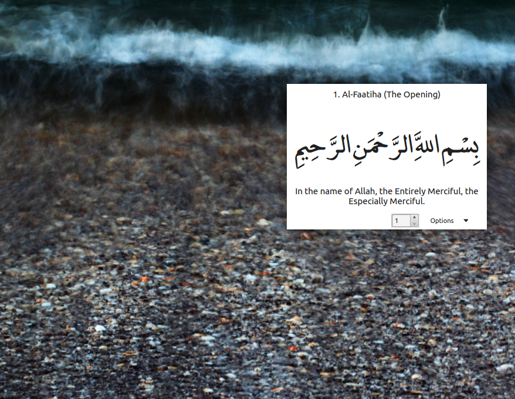

# Memorize Quran

Memorize Quran is a very simple application that stays on your desktop and rotates ayas for the specific sura that you select.
It also displays translation for current aya. You can change window opacity by using mouse wheel button.
It does not require internet connection. All the files are built in as resource files.

  

## Download

* [Windows 64 bit](https://raw.githubusercontent.com/rovshan-b/MemorizeQuran/master/executable/MemorizeQuran.zip)

## How to build

You can build it for Qt 4 as is. 
To build for Qt 5, open mainwindow.cpp file, on line 2 change `#include <QtGui>` to `#include <QtWidgets>` and build.
